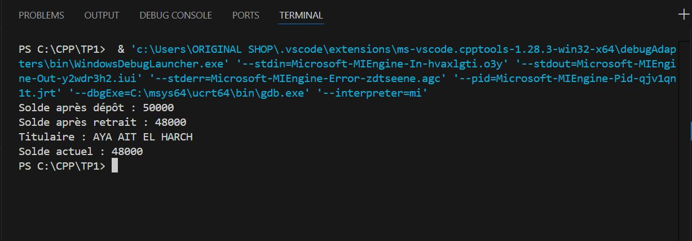

# 🧠 TP1 - Programmation C++

Ce projet contient les exercices du TP1 en C++.

## 📸 Captures d’écran

Voici les résultats d’exécution :

Exercice 1 :



Exercice 1 :


---

## ⚙ Compilation
```bash
g++ main.cpp -o main
./main